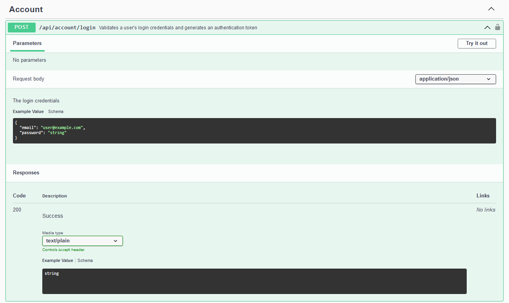
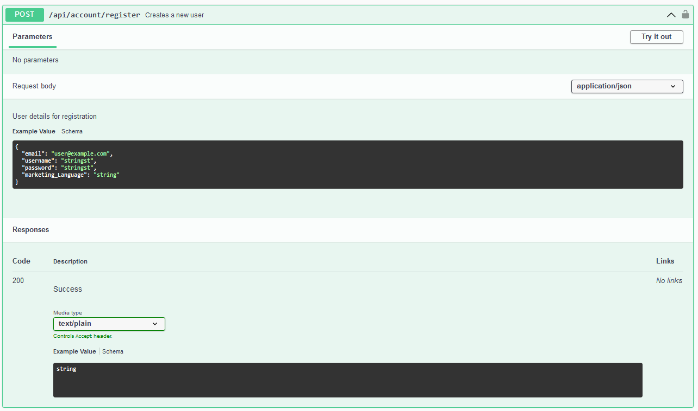
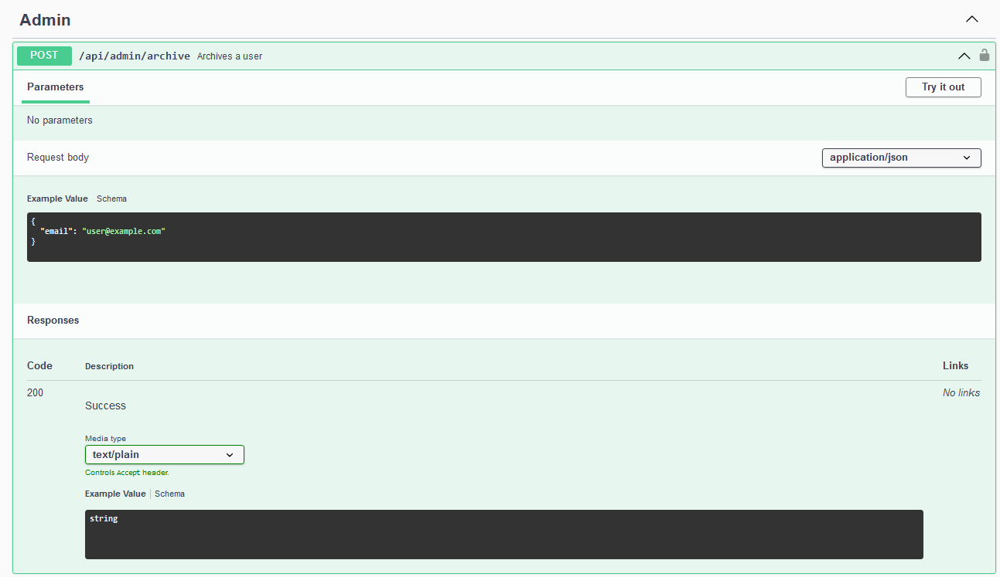
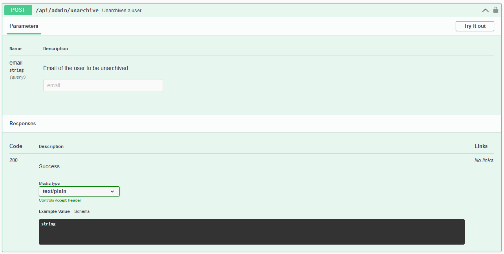
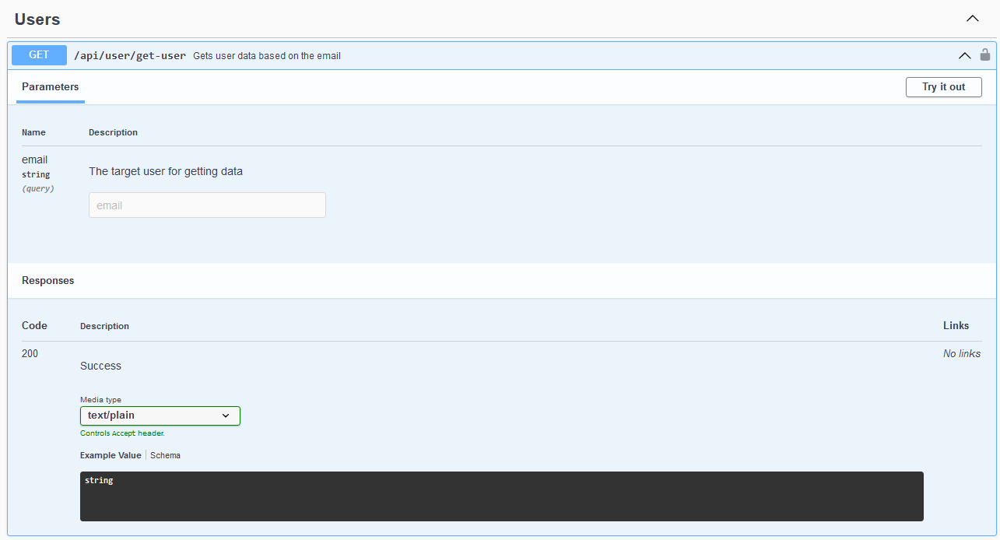
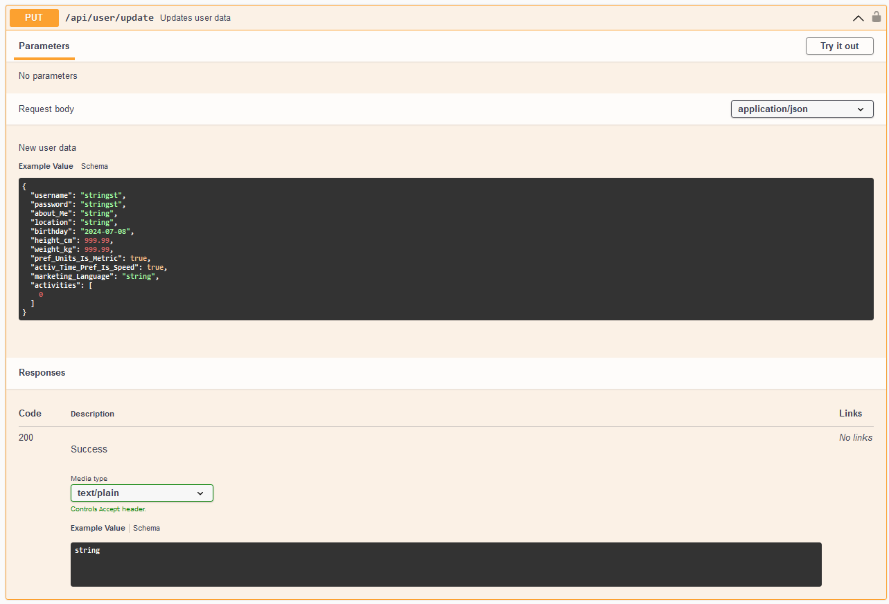
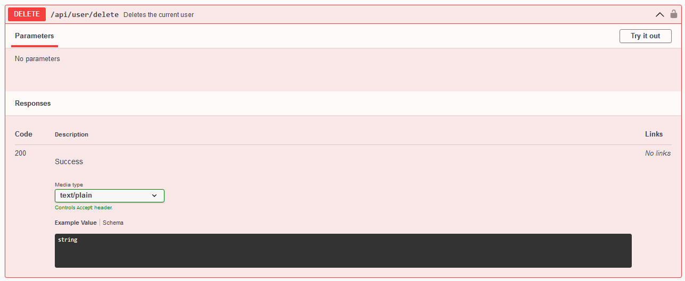

# COMP2001 Coursework

This repository is for my Comp2001 assessment 2 API.
It contains the API for my profiles microservice and the SQL files used to create the database.

### API
The [API](https://web.socem.plymouth.ac.uk/COMP2001/BSanderswyatt/) follows the RESTful API principles and is developed in ASP.net framework. It allows for all CRUD operations and uses [swagger UI](https://web.socem.plymouth.ac.uk/COMP2001/BSanderswyatt/swagger/index.html) to visualise the interations with the API

#### Goal
This microservices aim is to provide endpoints which can be used to create, read, update and delete users profiles while also allowing the viewing of other user’s profiles.

### Endpoints
#### Accounts

```http
POST api/account/login
```




```http
POST api/account/register
```



#### Admin

```http
POST api/admin/archive
```



```http
POST api/admin/unarchive
```



#### Users

```http
GET api/user/get-user
```



```http
PUT api/user/update
```


```http
DELETE api/user/delete
```


### SQL files
The SQL files were used to create my database which was hosted by the university.
